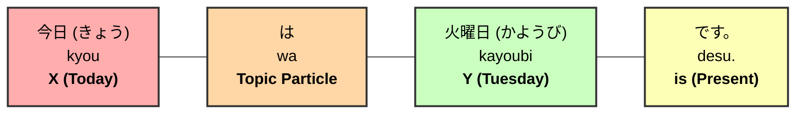
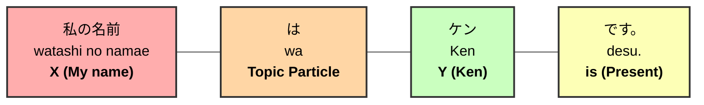
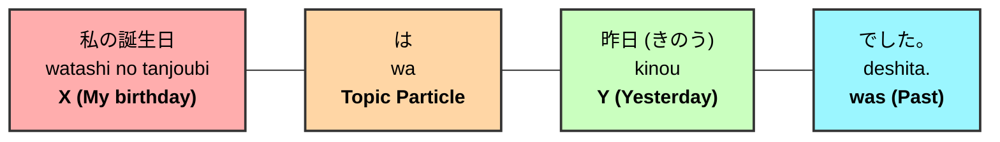
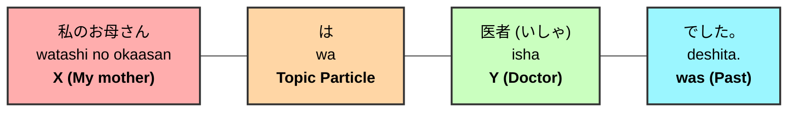

# Grammar Practice Solutions

This file contains the correct translations and structures for the grammar practice sentences.

---

## 1. Present Sentence Practice

### 1-A: Today is Tuesday.
- **Japanese**: 今日は火曜日です。
- **Romaji**: Kyou wa kayoubi desu.

#### **Breakdown Diagram**

### 1-B: My name is Ken.
- **Japanese**: 私の名前はケンです。
- **Romaji**: Watashi no namae wa Ken desu.

#### **Breakdown Diagram**

---

## 2. Past Sentence Practice

### 2-A: My birthday was yesterday.
- **Japanese**: 私の誕生日は昨日でした。
- **Romaji**: Watashi no tanjoubi wa kinou deshita.

#### **Breakdown Diagram**

### 2-B: My mother was a doctor.
- **Japanese**: 私のお母さんは医者でした。
- **Romaji**: Watashi no okaasan wa isha deshita.

#### **Breakdown Diagram**

