# Grammar Practice Solutions

This file contains the correct translations and structures for the grammar practice sentences.

---

## 1. Present Sentence Practice

### 1-A: Today is Tuesday.
- **Japanese**: 今日は火曜日です。
- **Romaji**: Kyou wa kayoubi desu.

#### **Breakdown Diagram**
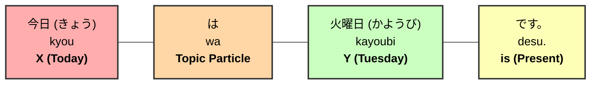

### 1-B: My name is Ken.
- **Japanese**: 私の名前はケンです。
- **Romaji**: Watashi no namae wa Ken desu.

#### **Breakdown Diagram**
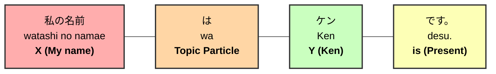

---

## 2. Past Sentence Practice

### 2-A: My birthday was yesterday.
- **Japanese**: 私の誕生日は昨日でした。
- **Romaji**: Watashi no tanjoubi wa kinou deshita.

#### **Breakdown Diagram**
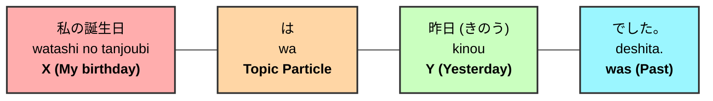

### 2-B: My mother was a doctor.
- **Japanese**: 私のお母さんは医者でした。
- **Romaji**: Watashi no okaasan wa isha deshita.

#### **Breakdown Diagram**
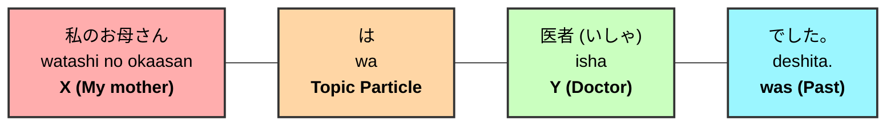
---

## 3. Asking Questions Practice

### 3-A: Is today Tuesday?
- **Japanese**: 今日は火曜日ですか。
- **Romaji**: Kyou wa kayoubi desu ka?

#### **Breakdown Diagram**
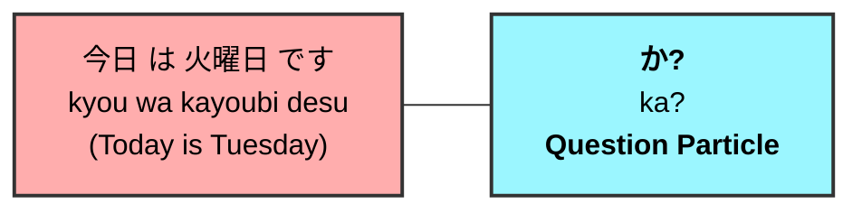

### 3-B: Is your name Miho?
- **Japanese**: あなたの名前はミホですか。
- **Romaji**: Anata no namae wa Miho desu ka?

#### **Breakdown Diagram**
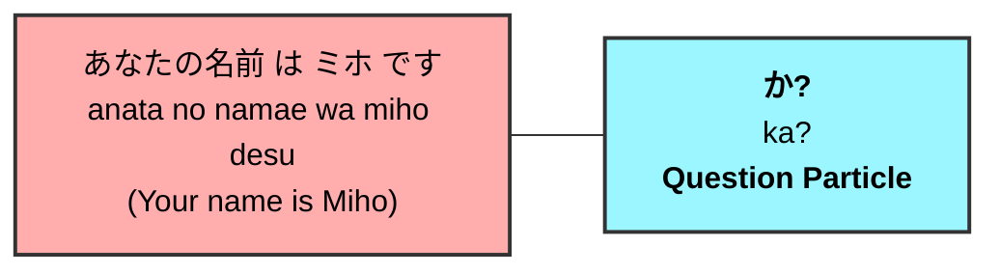

### 3-C: Was your birthday yesterday?
- **Japanese**: あなたの誕生日は昨日でしたか。
- **Romaji**: Anata no tanjoubi wa kinou deshita ka?

#### **Breakdown Diagram**
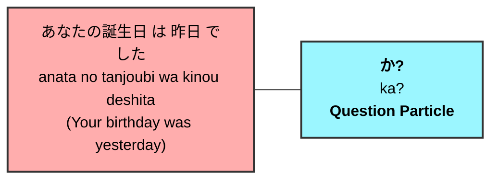
---

### 3-D: Was your mother a doctor?
- **Japanese**: あなたのお母さんは医者でしたか。
- **Romaji**: Anata no okaasan wa isha deshita ka?

#### **Breakdown Diagram**
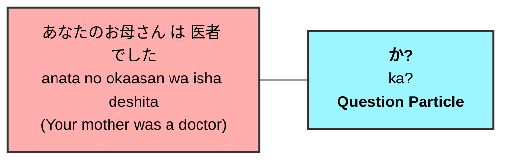

---

## 4. Question Word Practice (What, Who, Where, When)

### 4-A: What is your favorite food?
- **Japanese**: あなたの好きな食べ物は何ですか。
- **Romaji**: Anata no sukina tabemono wa nan desu ka?

#### **Breakdown Diagram**
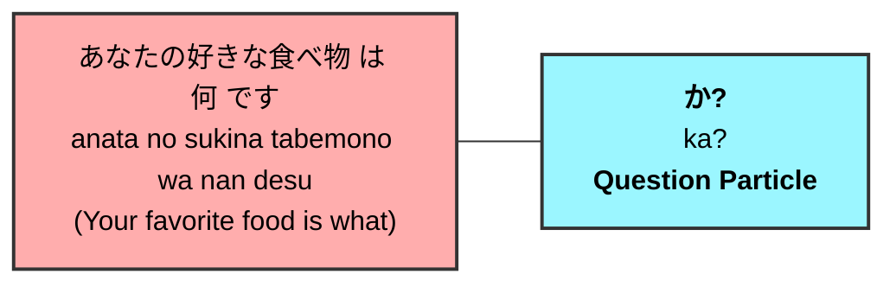

### 4-B: Where is your school?
- **Japanese**: あなたの学校はどこですか。
- **Romaji**: Anata no gakkou wa doko desu ka?

#### **Breakdown Diagram**
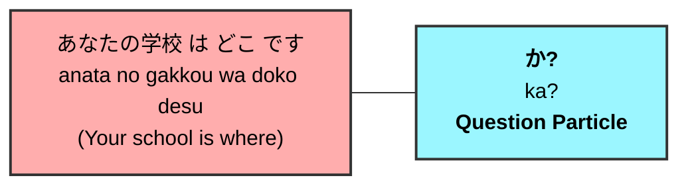

### 4-C: When is the party?
- **Japanese**: パーティーはいつですか。
- **Romaji**: Paatii wa itsu desu ka?

#### **Breakdown Diagram**
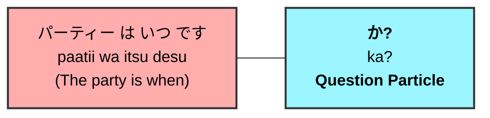

### 4-D: Who is your favorite singer?
- **Japanese**: あなたの好きな歌手は誰ですか。
- **Romaji**: Anata no sukina kashu wa dare desu ka?

#### **Breakdown Diagram**
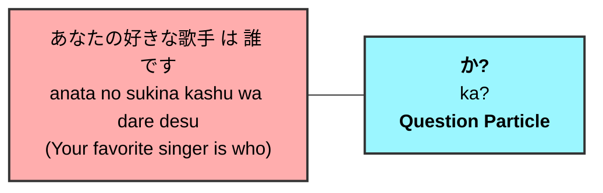
---

## 5. Particle "no" (の) Practice

### 5-A: Spanish language teacher
- **Japanese**: スペイン語の先生
- **Romaji**: Supeingo no sensei

#### **Breakdown Diagram**
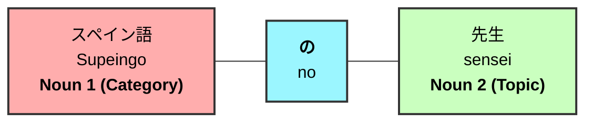

### 5-B: My summer vacation
- **Japanese**: 私の夏休み
- **Romaji**: Watashi no natsuyasumi

#### **Breakdown Diagram**
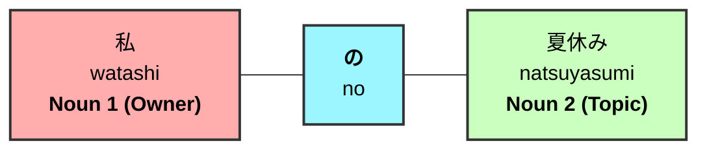
---

## 6. Particle "mo" (も) and Questions Solutions

### 6-A: I am an international student.
- **Japanese**: 私は留学生です。
- **Romaji**: Watashi wa ryuugakusei desu.

#### **Breakdown Diagram**
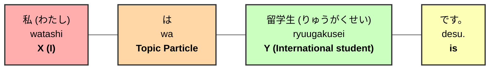

### 6-B: Satoshi is also a student.
- **Japanese**: サトシさんも学生です。
- **Romaji**: Satoshi-san mo gakusei desu.

#### **Breakdown Diagram**
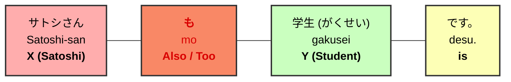

### 6-C: Is Satoshi a student?
- **Japanese**: サトシさんは学生ですか。
- **Romaji**: Satoshi-san wa gakusei desu ka?

#### **Breakdown Diagram**
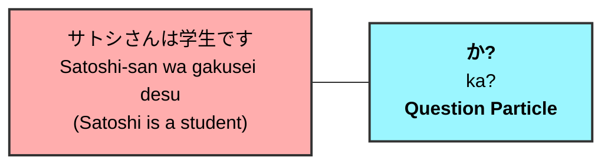

### 6-D: Was Satoshi also a student?
- **Japanese**: サトシさんも学生でしたか。
- **Romaji**: Satoshi-san mo gakusei deshita ka?

#### **Breakdown Diagram**
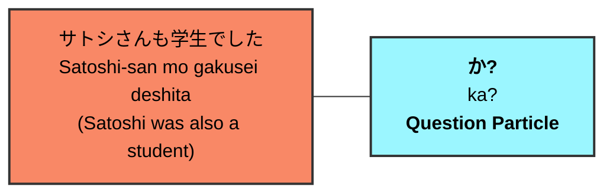

---

## 7. Negative Sentences Practice Solutions

### 7-A: Takeshi is not 19 years old.
- **Japanese**: たけしさんは十九歳（じゅうきゅうさい）じゃありません。
- **Romaji**: Takeshi-san wa juu-kyuu sai jaarimasen.

#### **Breakdown Diagram**
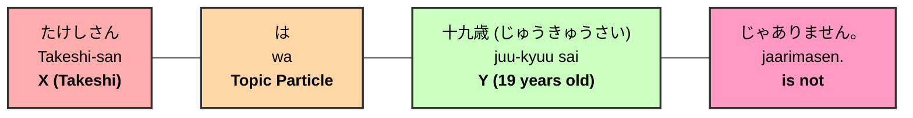

### 7-B: My father is not a police officer.
- **Japanese**: 私のお父さんは警察官じゃありません。
- **Romaji**: Watashi no otousan wa keisatsukan jaarimasen.

#### **Breakdown Diagram**
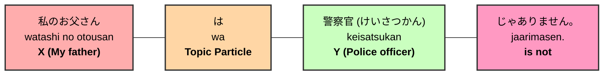

---

## 8. Past Negative Sentences Practice Solutions

### 8-A: Takeshi was not 19 years old.
- **Japanese**: たけしさんは十九歳じゃありませんでした。
- **Romaji**: Takeshi-san wa juu-kyuu sai jaarimasendeshita.

#### **Breakdown Diagram**
```mermaid
graph LR
    X["たけしさん<br/>Takeshi-san<br/><b>X (Takeshi)</b>"] --- P["は<br/>wa<br/><b>Topic Particle</b>"] --- Y["十九歳 (じゅうきゅうさい)<br/>juu-kyuu sai<br/><b>Y (19 years old)</b>"] --- V["じゃありませんでした。<br/>jaarimasendeshita.<br/><b>was not</b>"]
    style X fill:#ffadad,stroke:#333,stroke-width:2px,color:#000
    style P fill:#ffd6a5,stroke:#333,stroke-width:2px,color:#000
    style Y fill:#caffbf,stroke:#333,stroke-width:2px,color:#000
    style V fill:#ff99c2,stroke:#333,stroke-width:2px,color:#000
```

### 8-B: My father was not a police officer.
- **Japanese**: 私のお父さんは警察官じゃありませんでした。
- **Romaji**: Watashi no otousan wa keisatsukan jaarimasendeshita.

#### **Breakdown Diagram**
```mermaid
graph LR
    X["私のお父さん<br/>watashi no otousan<br/><b>X (My father)</b>"] --- P["は<br/>wa<br/><b>Topic Particle</b>"] --- Y["警察官 (けいさつかん)<br/>keisatsukan<br/><b>Y (Police officer)</b>"] --- V["じゃありませんでした。<br/>jaarimasendeshita.<br/><b>was not</b>"]
    style X fill:#ffadad,stroke:#333,stroke-width:2px,color:#000
    style P fill:#ffd6a5,stroke:#333,stroke-width:2px,color:#000
    style Y fill:#caffbf,stroke:#333,stroke-width:2px,color:#000
    style V fill:#ff99c2,stroke:#333,stroke-width:2px,color:#000
```

---

## 9. This/That Practice Solutions

### 9-A: This is my water bottle.
- **Japanese**: これは私の水筒です。
- **Romaji**: Kore wa watashi no suitou desu.

#### **Breakdown Diagram**
```mermaid
graph LR
    X["これ<br/>kore<br/><b>This</b>"] --- P["は<br/>wa<br/><b>Topic Particle</b>"] --- Y["私の水筒 (わたしのすいとう)<br/>watashi no suitou<br/><b>Y (My water bottle)</b>"] --- V["です。<br/>desu.<br/><b>is</b>"]
    style X fill:#ffadad,stroke:#333,stroke-width:2px,color:#000
    style P fill:#ffd6a5,stroke:#333,stroke-width:2px,color:#000
    style Y fill:#caffbf,stroke:#333,stroke-width:2px,color:#000
    style V fill:#fdffb6,stroke:#333,stroke-width:2px,color:#000
```

### 9-B: Which is your car?
- **Japanese**: あなたの車はどれですか？
- **Romaji**: Anata no kuruma wa dore desu ka?

#### **Breakdown Diagram**
```mermaid
graph LR
    X["あなたの車<br/>anata no kuruma<br/><b>X (Your car)</b>"] --- P["は<br/>wa<br/><b>Topic Particle</b>"] --- Y["どれ<br/>dore<br/><b>Y (Which)</b>"] --- V["ですか？<br/>desu ka?<br/><b>is?</b>"]
    style X fill:#ffadad,stroke:#333,stroke-width:2px,color:#000
    style P fill:#ffd6a5,stroke:#333,stroke-width:2px,color:#000
    style Y fill:#caffbf,stroke:#333,stroke-width:2px,color:#000
    style V fill:#9bf6ff,stroke:#333,stroke-width:2px,color:#000
```

### 9-C: What is that?
- **Japanese**: あれは何ですか？
- **Romaji**: Are wa nan desu ka?

#### **Breakdown Diagram**
```mermaid
graph LR
    X["あれ<br/>are<br/><b>That (far)</b>"] --- P["は<br/>wa<br/><b>Topic Particle</b>"] --- Y["何 (なん)<br/>nan<br/><b>Y (What)</b>"] --- V["ですか？<br/>desu ka?<br/><b>is?</b>"]
    style X fill:#ffadad,stroke:#333,stroke-width:2px,color:#000
    style P fill:#ffd6a5,stroke:#333,stroke-width:2px,color:#000
    style Y fill:#caffbf,stroke:#333,stroke-width:2px,color:#000
    style V fill:#9bf6ff,stroke:#333,stroke-width:2px,color:#000
```

---

## 10. この/その/あの Practice Solutions

### 10-A: This water bottle is mine.
- **Japanese**: この水筒は私のです。
- **Romaji**: Kono suitou wa watashi no desu.

#### **Breakdown Diagram**
```mermaid
graph LR
    D["この<br/>kono<br/><b>This</b>"] --- X["水筒 (すいとう)<br/>suitou<br/><b>Noun (Water bottle)</b>"] --- P["は<br/>wa<br/><b>Topic Particle</b>"] --- Y["私の<br/>watashi no<br/><b>Y (Mine)</b>"] --- V["です。<br/>desu.<br/><b>is</b>"]
    style D fill:#e4c1f9,stroke:#333,stroke-width:2px,color:#000
    style X fill:#ffadad,stroke:#333,stroke-width:2px,color:#000
    style P fill:#ffd6a5,stroke:#333,stroke-width:2px,color:#000
    style Y fill:#caffbf,stroke:#333,stroke-width:2px,color:#000
    style V fill:#fdffb6,stroke:#333,stroke-width:2px,color:#000
```

### 10-B: Which phone is yours?
- **Japanese**: どの携帯電話はあなたのですか？
- **Romaji**: Dono keitaidenwa wa anata no desu ka?

#### **Breakdown Diagram**
```mermaid
graph LR
    D["どの<br/>dono<br/><b>Which</b>"] --- X["携帯電話 (けいたいでんわ)<br/>keitaidenwa<br/><b>Noun (Phone)</b>"] --- P["は<br/>wa<br/><b>Topic Particle</b>"] --- Y["あなたの<br/>anata no<br/><b>Y (Yours)</b>"] --- V["ですか？<br/>desu ka?<br/><b>is?</b>"]
    style D fill:#e4c1f9,stroke:#333,stroke-width:2px,color:#000
    style X fill:#ffadad,stroke:#333,stroke-width:2px,color:#000
    style P fill:#ffd6a5,stroke:#333,stroke-width:2px,color:#000
    style Y fill:#caffbf,stroke:#333,stroke-width:2px,color:#000
    style V fill:#9bf6ff,stroke:#333,stroke-width:2px,color:#000
```

### 10-C: That phone is mine.
- **Japanese**: あの携帯電話は私のです。
- **Romaji**: Ano keitaidenwa wa watashi no desu.

#### **Breakdown Diagram**
```mermaid
graph LR
    D["あの<br/>ano<br/><b>That (far)</b>"] --- X["携帯電話 (けいたいでんわ)<br/>keitaidenwa<br/><b>Noun (Phone)</b>"] --- P["は<br/>wa<br/><b>Topic Particle</b>"] --- Y["私の<br/>watashi no<br/><b>Y (Mine)</b>"] --- V["です。<br/>desu.<br/><b>is</b>"]
    style D fill:#e4c1f9,stroke:#333,stroke-width:2px,color:#000
    style X fill:#ffadad,stroke:#333,stroke-width:2px,color:#000
    style P fill:#ffd6a5,stroke:#333,stroke-width:2px,color:#000
    style Y fill:#caffbf,stroke:#333,stroke-width:2px,color:#000
    style V fill:#fdffb6,stroke:#333,stroke-width:2px,color:#000
```

### 10-D: Is that lady Mikiko?
- **Japanese**: あの女性はミキコさんですか？
- **Romaji**: Ano josei wa Mikiko-san desu ka?

#### **Breakdown Diagram**
```mermaid
graph LR
    Aff["あの女性 は ミキコさん です<br/>ano josei wa Mikiko-san desu<br/>(That lady is Mikiko)"] --- Q["<b>か?</b><br/>ka?<br/><b>Question Particle</b>"]
    style Aff fill:#ffadad,stroke:#333,stroke-width:2px,color:#000
    style Q fill:#9bf6ff,stroke:#333,stroke-width:2px,color:#000
```

### 10-E: That lady is not Mikiko.
- **Japanese**: あの女性はミキコさんじゃありません。
- **Romaji**: Ano josei wa Mikiko-san jaarimasen.

#### **Breakdown Diagram**
```mermaid
graph LR
    D["あの<br/>ano<br/><b>That (far)</b>"] --- X["女性 (じょせい)<br/>josei<br/><b>Noun (Lady)</b>"] --- P["は<br/>wa<br/><b>Topic Particle</b>"] --- Y["ミキコさん<br/>Mikiko-san<br/><b>Y (Mikiko)</b>"] --- V["じゃありません。<br/>jaarimasen.<br/><b>is not</b>"]
    style D fill:#e4c1f9,stroke:#333,stroke-width:2px,color:#000
    style X fill:#ffadad,stroke:#333,stroke-width:2px,color:#000
    style P fill:#ffd6a5,stroke:#333,stroke-width:2px,color:#000
    style Y fill:#caffbf,stroke:#333,stroke-width:2px,color:#000
    style V fill:#ff99c2,stroke:#333,stroke-width:2px,color:#000
```

---

## 11. だれの (Whose) Practice Solutions

### 11-A: Whose mother is she?
- **Japanese**: 彼女は誰のお母さんですか？
- **Romaji**: Kanojo wa dare no okaasan desu ka?

#### **Breakdown Diagram**
```mermaid
graph LR
    X["彼女 (かのじょ)<br/>kanojo<br/><b>X (She)</b>"] --- P["は<br/>wa<br/><b>Topic Particle</b>"] --- QW["誰の<br/>dare no<br/><b>Whose</b>"] --- N["お母さん<br/>okaasan<br/><b>Noun (Mother)</b>"] --- V["ですか？<br/>desu ka?<br/><b>is?</b>"]
    style X fill:#ffadad,stroke:#333,stroke-width:2px,color:#000
    style P fill:#ffd6a5,stroke:#333,stroke-width:2px,color:#000
    style QW fill:#e4c1f9,stroke:#333,stroke-width:2px,color:#000
    style N fill:#caffbf,stroke:#333,stroke-width:2px,color:#000
    style V fill:#9bf6ff,stroke:#333,stroke-width:2px,color:#000
```

### 11-B: Whose house is that?
- **Japanese**: あれは誰の家ですか？
- **Romaji**: Are wa dare no ie desu ka?

#### **Breakdown Diagram**
```mermaid
graph LR
    X["あれ<br/>are<br/><b>That (far)</b>"] --- P["は<br/>wa<br/><b>Topic Particle</b>"] --- QW["誰の<br/>dare no<br/><b>Whose</b>"] --- N["家 (いえ)<br/>ie<br/><b>Noun (House)</b>"] --- V["ですか？<br/>desu ka?<br/><b>is?</b>"]
    style X fill:#ffadad,stroke:#333,stroke-width:2px,color:#000
    style P fill:#ffd6a5,stroke:#333,stroke-width:2px,color:#000
    style QW fill:#e4c1f9,stroke:#333,stroke-width:2px,color:#000
    style N fill:#caffbf,stroke:#333,stroke-width:2px,color:#000
    style V fill:#9bf6ff,stroke:#333,stroke-width:2px,color:#000
```

### 11-C: Whose wallet is this?
- **Japanese**: これは誰の財布ですか？
- **Romaji**: Kore wa dare no saifu desu ka?

#### **Breakdown Diagram**
```mermaid
graph LR
    X["これ<br/>kore<br/><b>This</b>"] --- P["は<br/>wa<br/><b>Topic Particle</b>"] --- QW["誰の<br/>dare no<br/><b>Whose</b>"] --- N["財布 (さいふ)<br/>saifu<br/><b>Noun (Wallet)</b>"] --- V["ですか？<br/>desu ka?<br/><b>is?</b>"]
    style X fill:#ffadad,stroke:#333,stroke-width:2px,color:#000
    style P fill:#ffd6a5,stroke:#333,stroke-width:2px,color:#000
    style QW fill:#e4c1f9,stroke:#333,stroke-width:2px,color:#000
    style N fill:#caffbf,stroke:#333,stroke-width:2px,color:#000
    style V fill:#9bf6ff,stroke:#333,stroke-width:2px,color:#000
```
