# Grammar (文法)

This document contains important grammar rules and patterns for JLPT N5!

---

## 1. Asking about Time and Dates

These are common question forms using N5 grammar patterns for asking about times and dates.

| English | Romaji | Japanese |
| :--- | :--- | :--- |
| **What time is it now?** | Ima nan-ji desu ka? | 今は何時ですか。 |
| **What day/date is it today?** | Kyou wa nan-nichi desu ka? | 今日は何日ですか。 |
| **What day of the week is it?** | Kyou wa nan-youbi desu ka? | 今日は何曜日ですか。 |
| **What month is it?** | Ima nan-gatsu desu ka? | 今は何月ですか。 |
| **When is your birthday?** | Tanjoubi wa itsu desu ka? | 誕生日はいつですか。 |

> [!TIP]
> Notice the pattern! Japanese grammar relies on question words like **何 (nan / nani)** meaning "what" combined with counters:
> - What time = **nan-ji** (何時)
> - What day = **nan-nichi** (何日)
> - What month = **nan-gatsu** (何月)

---

## 2. Topic Marker: X is Y

The most basic sentence structure in Japanese is **X は Y です** (X wa Y desu).

### The Particle は (ha / wa)
- **Written as:** は (ha)
- **Pronounced as:** **wa** (when used as a grammar particle)
- **Function:** Marks the **Topic** of the sentence (the "X").

### The Verb です (desu) vs でした (deshita)
- **です (desu):** Present tense ("is / am / are").
- **でした (deshita):** Past tense ("was / were").

---

## 3. Examples with Diagrams

Here is how the structure "X は Y です" looks visually:

### A. Present Tense: "I am Japanese."
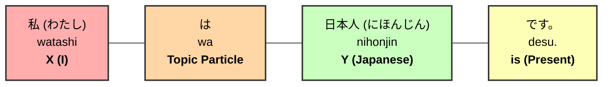

### B. Present Tense: "You are a student."
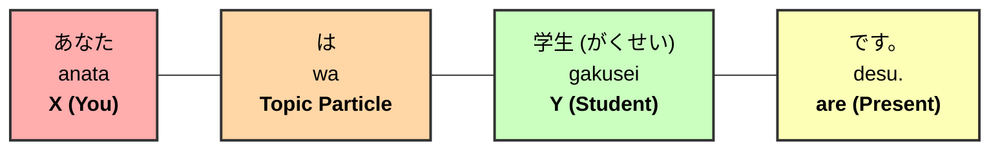

### C. Present Tense: "Today is Monday."
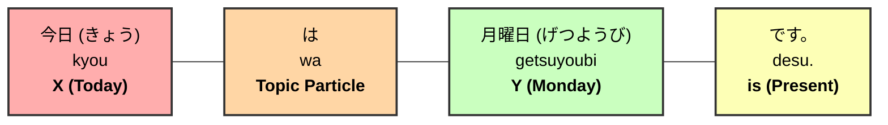

---

### D. Past Tense: "Yesterday was Sunday."
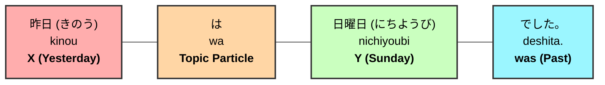

### E. Past Tense: "He was a teacher."
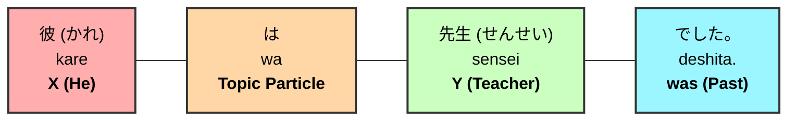

### F. Past Tense: "Dinner was sushi."
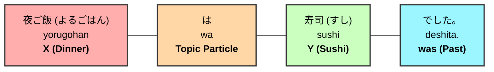

---

## 4. Practice Session (Statements)

Try to translate these sentences yourself!

1. **Today is Tuesday.**
2. **My name is Ken.**
3. **My birthday was yesterday.**
4. **My mother was a doctor.**

**[Check Statement Solutions Here](./grammar-solutions.md#1-present-sentence-practice)**

---

## 5. Asking Questions

In Japanese, we turn a statement into a question by simply adding **か (ka)** at the end.

### How to Build a Question (3 Steps)

| Step | Instruction | Example |
| :--- | :--- | :--- |
| **Step 1** | Build an affirmative sentence in English. | "Are you Japanese?" |
| **Step 2** | Translate the affirmative sentence to Japanese. | あなたは日本人です。 (Anata wa nihonjin desu.) |
| **Step 3** | Add **か?** at the end of the sentence. | **あなたは日本人ですか?** (Anata wa nihonjin desu **ka**?) |

---

### How to Answer a Question

#### Formal Responses (Standard)
1. **はい (Hai)** = Yes
2. **いいえ (Iie)** = No

#### Casual Responses (With Friends/Family)
1. **うん (Un)** = Yes
2. **ううん (Uun)** = No

---

## 6. Question Examples

### A. "Are you a student?"
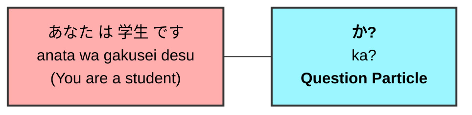

### B. "Was yesterday Sunday?"
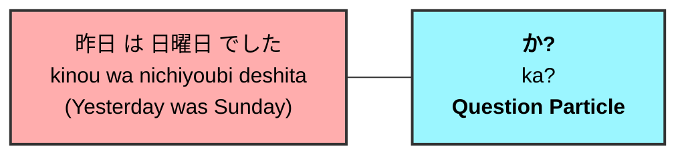

### C. "Was dinner sushi?"
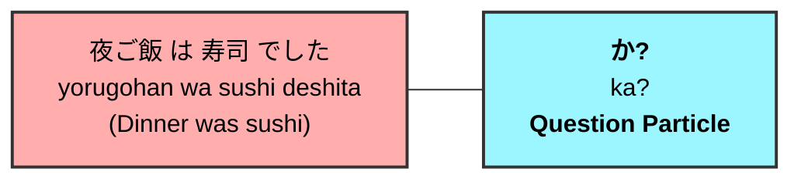

---

## 7. Practice Session (Questions)

Try to translate these questions:

1. **Is today Tuesday?**
2. **Is your name Miho?**
3. **Was your birthday yesterday?**
4. **Was your mother a doctor?**


**[Check Question Solutions Here](./grammar-solutions.md#3-asking-questions-practice)**

---

## 8. Questions with "What, Who, Where, and When"

When a question sentence includes any of the question words below, you will need to be careful with word order when building the sentence.

### The Question Words
- **What**: 何 (なに - nani / なん - nan)
- **Who**: 誰 (だれ - dare)
- **Where**: どこ (doko)
- **When**: いつ (itsu)

### How to Build a Question Word Sentence (2 Steps)

| Step | Instruction | Example Sentence |
| :--- | :--- | :--- |
| **Step 1** | Switch the words before and after "is/are" in English. | "Where is your house?" -> **"Your house is where?"** |
| **Step 2** | Translate the switched sentence into Japanese. | **あなたの家はどこですか。** (Anata no ie wa doko desu ka?) |

---

## 9. Examples with Diagrams

### A. "Where is your house?"
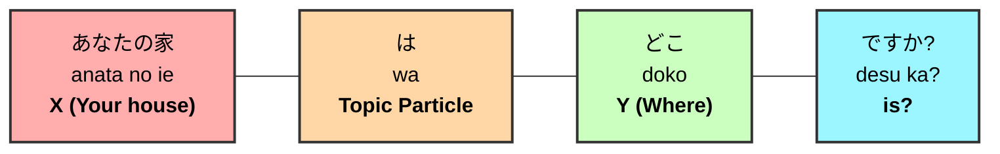

### B. "Who is your teacher?"
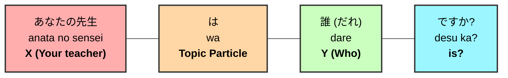

### C. "When is your birthday?"
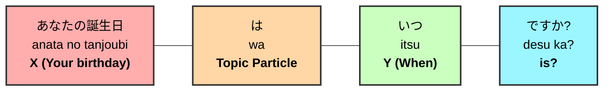

---

## 10. Practice Session (Question Words)

Try to translate these questions:

1. **What is your favorite food?**
2. **Where is your school?**
3. **When is the party?**
4. **Who is your favorite singer?**

**[Check Question Word Solutions Here](./grammar-solutions.md#4-question-word-practice-what-who-where-when)**


---

## 11. Nationality and Language

In Japanese, you can easily form the name of a nationality or a language by adding a specific suffix to the country name.

### Suffix Rules
- **Country + 人 (jin) = Nationality**
    - Example: 日本 (Nihon) + 人 (jin) = **日本人** (Nihonjin / Japanese person)
- **Country + 語 (go) = Language**
    - Example: 日本 (Nihon) + 語 (go) = **日本語** (Nihongo / Japanese language)

### Country Comparison Table

| Country | Romaji | Nationality (...人) | Language (...語) |
| :--- | :--- | :--- | :--- |
| **Japan** | Nihon | 日本人 (Japanese) | 日本語 (Japanese) |
| **Spain** | Supein | スペイン人 (Spanish) | スペイン語 (Spanish) |
| **China** | Chuugoku | 中国人 (Chinese) | 中国語 (Chinese) |
| **Germany** | Doitsu | ドイツ人 (German) | ドイツ語 (German) |
| **Australia** | Oosutoraria | オーストラリア人 (Australian) | 英語* (English) |
| **USA** | Amerika | アメリカ人 (American) | 英語* (English) |

> [!NOTE]
> **Exception for English Language**:
> For countries that speak English (like USA, Australia, or UK), the word for the language is **英語 (えいご - Eigo)**, not "Amerikago" or others.

---

## 12. The Particle "no" (の)

The particle **の (no)** is used to connect two nouns. It often functions like "'s" in English or the word "of".

### Structure: Noun 1 + の + Noun 2

| Example | Japanese | Romaji | Meaning |
| :--- | :--- | :--- | :--- |
| **Possession** | 私**の**名前 | Watashi **no** namae | My name |
| **Relationship** | たけしさん**の**お母さん | Takeshi-san **no** okaasan | Takeshi's mother |
| **Category** | 日本語**の**先生 | Nihongo **no** sensei | Japanese language teacher |

### Visual Breakdown (Generic Structure)
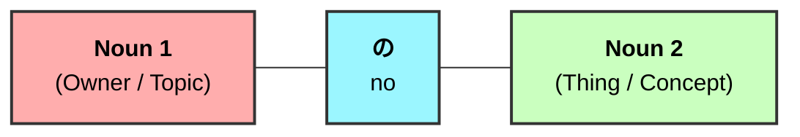

### Examples with Diagrams

1. **My name**
- **Japanese**: 私の名前
- **Romaji**: Watashi no namae

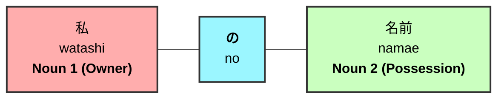

2. **Takeshi's phone number**
- **Japanese**: たけしさんの電話番号
- **Romaji**: Takeshi-san no denwa bangou

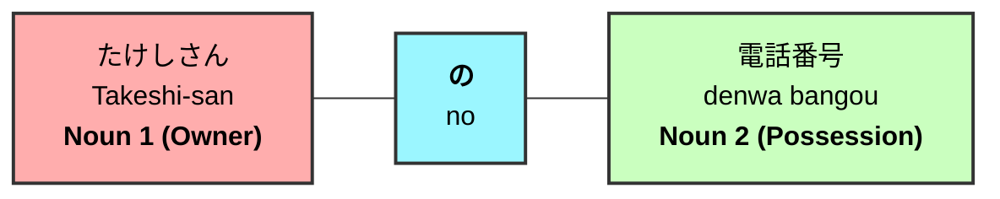

3. **A Japanese language teacher**
- **Japanese**: 日本語の先生
- **Romaji**: Nihongo no sensei

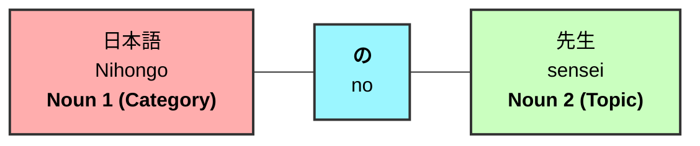

---

### **Important: Difference between は (wa) and の (no)**

It is very important to use the correct particle, as it changes the whole meaning of the sentence!

1.  **Noun 1 は Noun 2** (Noun 1 **IS** Noun 2)
    - *Example*: わたし**は**お母さんです。 (Watashi **wa** okaasan desu.)
    - *Meaning*: **I am** a mother.

2.  **Noun 1 の Noun 2** (Noun 2 **OF** Noun 1)
    - *Example*: わたし**の**お母さんです。 (Watashi **no** okaasan desu.)
    - *Meaning*: (This/She) is **my** mother.

---

### What is a Noun?
In case you forgot, a **Noun** is a word that represents a:
- **Person** (Watashi, Sensei, Okaasan)
- **Place** (Australia, Gakkou)
- **Thing/Concept** (Namae, Nihongo, Denwa bangou)

---

## 13. Practice Session (Particle "no")

Try to translate these phrases:

1. **Spanish language teacher**
2. **My summer vacation**

**[Check Particle "no" Solutions Here](./grammar-solutions.md#5-particle-no-の-practice)**

---

## 14. The Particle "mo" (も)

The particle **も (mo)** is used to mean "too", "also", or "as well". 

### Function: Replacing the Topic Marker
In a sentence, **も (mo)** replaces the topic particle **は (wa)** when you want to show that the topic is the same as a previous one or adds to a previous statement.

| Particle | Meaning | Example (Japanese) | Meaning |
| :--- | :--- | :--- | :--- |
| **は (wa)** | Topic Marker (is/am/are) | 私は日本人です。 | I am Japanese. |
| **も (mo)** | Also / Too | **私 も 日本人 です。** | **I am Japanese too.** |

### Visual Breakdown

When we use **も (mo)** instead of **は (wa)**, the structure remains the same, but the "Topic" now includes the meaning of "Also".

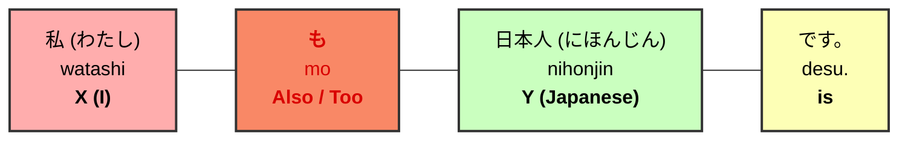

### Detailed Examples

1. **My mother is 42 years old.**
- **Japanese**: 私のお母さんは四十二歳（よんじゅうにさい）です。
- **Romaji**: Watashi no okaasan wa yonjuu-ni sai desu.

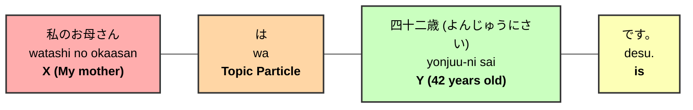

2. **Miho's younger brother is a high school student.**
- **Japanese**: ミホさんの弟は高校生です。
- **Romaji**: Miho-san no otouto wa koukousei desu.

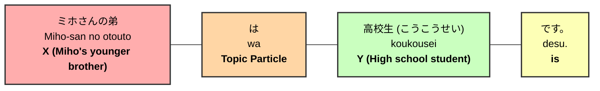

3. **Satsuki is a Japanese language teacher too.**
- **Japanese**: サツキさんも日本語の先生です。
- **Romaji**: Satsuki-san mo nihongo no sensei desu.

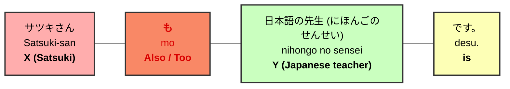

---

## 15. Practice Session (Particle "mo" and Questions)

Try to translate these sentences:

1. **I am an international student.**
2. **Satoshi is also a student.**
3. **Is Satoshi a student?**
4. **Was Satoshi also a student?**

**[Check Particle "mo" Solutions Here](./grammar-solutions.md#6-particle-mo-も-practice-solutions)**

---

## 16. Negative Sentences (Present Tense)

To say "X is not Y" in Japanese, you can use two common expressions. Both mean the same thing, but the nuance in formality can slightly differ.

**Structure:** X は Y [Negative Ending]

### Two Ways to Say "is not"

| Japanese | Romaji | Formality |
| :--- | :--- | :--- |
| **じゃありません。** | jaarimasen. | Formal/Polite (Common in textbooks / written) |
| **じゃないです。** | janaidesu. | Slightly less formal (Very common in spoken Japanese) |

### Visual Breakdown

Both structures follow the basic topic marker pattern.

#### Option 1: じゃありません (jaarimasen)
```mermaid
graph LR
    X["<b>X</b><br/>(Topic)"] --- P["<b>は</b><br/>wa<br/><b>Topic Particle</b>"] --- Y["<b>Y</b><br/>(Noun)"] --- V["<b>じゃありません。</b><br/>jaarimasen.<br/><b>is not</b>"]
    style X fill:#ffadad,stroke:#333,stroke-width:2px,color:#000
    style P fill:#ffd6a5,stroke:#333,stroke-width:2px,color:#000
    style Y fill:#caffbf,stroke:#333,stroke-width:2px,color:#000
    style V fill:#ff99c2,stroke:#333,stroke-width:2px,color:#000
```

#### Option 2: じゃないです (janaidesu)
```mermaid
graph LR
    X["<b>X</b><br/>(Topic)"] --- P["<b>は</b><br/>wa<br/><b>Topic Particle</b>"] --- Y["<b>Y</b><br/>(Noun)"] --- V["<b>じゃないです。</b><br/>janaidesu.<br/><b>is not</b>"]
    style X fill:#ffadad,stroke:#333,stroke-width:2px,color:#000
    style P fill:#ffd6a5,stroke:#333,stroke-width:2px,color:#000
    style Y fill:#caffbf,stroke:#333,stroke-width:2px,color:#000
    style V fill:#ff99c2,stroke:#333,stroke-width:2px,color:#000
```

### Detailed Examples

1. **Takeshi is not 15 years old.**
- **Japanese**: たけしさんは十五歳（じゅうごさい）じゃありません。
- **Romaji**: Takeshi-san wa juu-go sai jaarimasen.

```mermaid
graph LR
    X["たけしさん<br/>Takeshi-san<br/><b>X (Takeshi)</b>"] --- P["は<br/>wa<br/><b>Topic Particle</b>"] --- Y["十五歳 (じゅうごさい)<br/>juu-go sai<br/><b>Y (15 years old)</b>"] --- V["じゃありません。<br/>jaarimasen.<br/><b>is not</b>"]
    style X fill:#ffadad,stroke:#333,stroke-width:2px,color:#000
    style P fill:#ffd6a5,stroke:#333,stroke-width:2px,color:#000
    style Y fill:#caffbf,stroke:#333,stroke-width:2px,color:#000
    style V fill:#ff99c2,stroke:#333,stroke-width:2px,color:#000
```

2. **Tomorrow is not Saturday.**
- **Japanese**: 明日は土曜日じゃありません。
- **Romaji**: Ashita wa doyoubi jaarimasen.

```mermaid
graph LR
    X["明日 (あした)<br/>ashita<br/><b>X (Tomorrow)</b>"] --- P["は<br/>wa<br/><b>Topic Particle</b>"] --- Y["土曜日 (どようび)<br/>doyoubi<br/><b>Y (Saturday)</b>"] --- V["じゃありません。<br/>jaarimasen.<br/><b>is not</b>"]
    style X fill:#ffadad,stroke:#333,stroke-width:2px,color:#000
    style P fill:#ffd6a5,stroke:#333,stroke-width:2px,color:#000
    style Y fill:#caffbf,stroke:#333,stroke-width:2px,color:#000
    style V fill:#ff99c2,stroke:#333,stroke-width:2px,color:#000
```

3. **I am not a student.**
- **Japanese**: 私は学生じゃありません。
- **Romaji**: Watashi wa gakusei jaarimasen.

```mermaid
graph LR
    X["私 (わたし)<br/>watashi<br/><b>X (I)</b>"] --- P["は<br/>wa<br/><b>Topic Particle</b>"] --- Y["学生 (がくせい)<br/>gakusei<br/><b>Y (Student)</b>"] --- V["じゃありません。<br/>jaarimasen.<br/><b>is not</b>"]
    style X fill:#ffadad,stroke:#333,stroke-width:2px,color:#000
    style P fill:#ffd6a5,stroke:#333,stroke-width:2px,color:#000
    style Y fill:#caffbf,stroke:#333,stroke-width:2px,color:#000
    style V fill:#ff99c2,stroke:#333,stroke-width:2px,color:#000
```

---

## 17. Practice Session (Negative Sentences)

Try to translate these sentences using **じゃありません**:

1. **Takeshi is not 19 years old.**
2. **My father is not a police officer.**

**[Check Negative Solutions Here](./grammar-solutions.md#7-negative-sentences-practice-solutions)**

---

## 18. Negative Sentences (Past Tense)

To say "X was not Y" in Japanese, you use the past tense versions of the negative endings.

**Structure:** X は Y [Past Negative Ending]

### Two Ways to Say "was not"

| Japanese | Romaji | Formality |
| :--- | :--- | :--- |
| **じゃありませんでした。** | jaarimasendeshita. | Formal/Polite (Common in written / formal speech) |
| **じゃなかったです。** | janakattadesu. | Slightly less formal (Common in spoken Japanese) |

### Visual Breakdown

Both structures follow the fundamental topic format, just modifying the "is not" to "was not".

#### Option 1: じゃありませんでした (jaarimasendeshita)
```mermaid
graph LR
    X["<b>X</b><br/>(Topic)"] --- P["<b>は</b><br/>wa<br/><b>Topic Particle</b>"] --- Y["<b>Y</b><br/>(Noun)"] --- V["<b>じゃありませんでした。</b><br/>jaarimasendeshita.<br/><b>was not</b>"]
    style X fill:#ffadad,stroke:#333,stroke-width:2px,color:#000
    style P fill:#ffd6a5,stroke:#333,stroke-width:2px,color:#000
    style Y fill:#caffbf,stroke:#333,stroke-width:2px,color:#000
    style V fill:#ff99c2,stroke:#333,stroke-width:2px,color:#000
```

#### Option 2: じゃなかったです (janakattadesu)
```mermaid
graph LR
    X["<b>X</b><br/>(Topic)"] --- P["<b>は</b><br/>wa<br/><b>Topic Particle</b>"] --- Y["<b>Y</b><br/>(Noun)"] --- V["<b>じゃなかったです。</b><br/>janakattadesu.<br/><b>was not</b>"]
    style X fill:#ffadad,stroke:#333,stroke-width:2px,color:#000
    style P fill:#ffd6a5,stroke:#333,stroke-width:2px,color:#000
    style Y fill:#caffbf,stroke:#333,stroke-width:2px,color:#000
    style V fill:#ff99c2,stroke:#333,stroke-width:2px,color:#000
```

### Detailed Examples

1. **I was not a student.**
- **Japanese**: 私は学生じゃありませんでした。
- **Romaji**: Watashi wa gakusei jaarimasendeshita.

```mermaid
graph LR
    X["私 (わたし)<br/>watashi<br/><b>X (I)</b>"] --- P["は<br/>wa<br/><b>Topic Particle</b>"] --- Y["学生 (がくせい)<br/>gakusei<br/><b>Y (Student)</b>"] --- V["じゃありませんでした。<br/>jaarimasendeshita.<br/><b>was not</b>"]
    style X fill:#ffadad,stroke:#333,stroke-width:2px,color:#000
    style P fill:#ffd6a5,stroke:#333,stroke-width:2px,color:#000
    style Y fill:#caffbf,stroke:#333,stroke-width:2px,color:#000
    style V fill:#ff99c2,stroke:#333,stroke-width:2px,color:#000
```

2. **Yesterday was not a sale.**
- **Japanese**: 昨日はセールじゃありませんでした。
- **Romaji**: Kinou wa se-ru jaarimasendeshita.

```mermaid
graph LR
    X["昨日 (きのう)<br/>kinou<br/><b>X (Yesterday)</b>"] --- P["は<br/>wa<br/><b>Topic Particle</b>"] --- Y["セール<br/>se-ru<br/><b>Y (Sale)</b>"] --- V["じゃありませんでした。<br/>jaarimasendeshita.<br/><b>was not</b>"]
    style X fill:#ffadad,stroke:#333,stroke-width:2px,color:#000
    style P fill:#ffd6a5,stroke:#333,stroke-width:2px,color:#000
    style Y fill:#caffbf,stroke:#333,stroke-width:2px,color:#000
    style V fill:#ff99c2,stroke:#333,stroke-width:2px,color:#000
```

3. **My dream was not to be a singer.**
- **Japanese**: 私の夢は歌手じゃありませんでした。
- **Romaji**: Watashi no yume wa kashu jaarimasendeshita.

```mermaid
graph LR
    X["私の夢<br/>watashi no yume<br/><b>X (My dream)</b>"] --- P["は<br/>wa<br/><b>Topic Particle</b>"] --- Y["歌手 (かしゅ)<br/>kashu<br/><b>Y (Singer)</b>"] --- V["じゃありませんでした。<br/>jaarimasendeshita.<br/><b>was not</b>"]
    style X fill:#ffadad,stroke:#333,stroke-width:2px,color:#000
    style P fill:#ffd6a5,stroke:#333,stroke-width:2px,color:#000
    style Y fill:#caffbf,stroke:#333,stroke-width:2px,color:#000
    style V fill:#ff99c2,stroke:#333,stroke-width:2px,color:#000
```

4. **Mr. Suzuki was not a teacher.**
- **Japanese**: 鈴木さんは先生じゃありませんでした。
- **Romaji**: Suzuki-san wa sensei jaarimasendeshita.

```mermaid
graph LR
    X["鈴木さん<br/>Suzuki-san<br/><b>X (Mr. Suzuki)</b>"] --- P["は<br/>wa<br/><b>Topic Particle</b>"] --- Y["先生 (せんせい)<br/>sensei<br/><b>Y (Teacher)</b>"] --- V["じゃありませんでした。<br/>jaarimasendeshita.<br/><b>was not</b>"]
    style X fill:#ffadad,stroke:#333,stroke-width:2px,color:#000
    style P fill:#ffd6a5,stroke:#333,stroke-width:2px,color:#000
    style Y fill:#caffbf,stroke:#333,stroke-width:2px,color:#000
    style V fill:#ff99c2,stroke:#333,stroke-width:2px,color:#000
```

---

## 19. Practice Session (Past Negative Sentences)

Try to translate these sentences using **じゃありませんでした**:

1. **Takeshi was not 19 years old.**
2. **My father was not a police officer.**

**[Check Past Negative Solutions Here](./grammar-solutions.md#8-past-negative-sentences-practice-solutions)**

---

## 20. "This" and "That" (これ、あれ、それ、どれ)

### The Words

* **これ (kore)**: Use "これ" for things that is close to the speaker.
* **それ (sore)**: Use "それ" for things that is close to the listener.
* **あれ (are)**: Use "あれ" for things that are far away from the speaker and the listener.
* **どれ (dore)**: Use when you ask which one.

> [!IMPORTANT]
> **これ、あれ、それ、どれ will never be followed by a noun.**

### Sentence Structures

| Structure | Meaning |
| :--- | :--- |
| **これ/それ/あれ は X です。** <br/> (kore/sore/are wa X desu.) | This/That is X. |
| **これ/それ/あれ は X ですか？** <br/> (kore/sore/are wa X desuka?) | Is this/that X? |
| **X は どれ ですか？** <br/> (X wa dore desuka?) | Which one is X? |

---

## 21. Examples with Diagrams (This/That)

### A. "This is a book."
- **Japanese**: これは本です。
- **Romaji**: Kore wa hon desu.

```mermaid
graph LR
    X["これ<br/>kore<br/><b>This</b>"] --- P["は<br/>wa<br/><b>Topic Particle</b>"] --- Y["本 (ほん)<br/>hon<br/><b>Y (Book)</b>"] --- V["です。<br/>desu.<br/><b>is</b>"]
    style X fill:#ffadad,stroke:#333,stroke-width:2px,color:#000
    style P fill:#ffd6a5,stroke:#333,stroke-width:2px,color:#000
    style Y fill:#caffbf,stroke:#333,stroke-width:2px,color:#000
    style V fill:#fdffb6,stroke:#333,stroke-width:2px,color:#000
```

### B. "That is my house."
- **Japanese**: あれは私の家です。
- **Romaji**: Are wa watashi no ie desu.

```mermaid
graph LR
    X["あれ<br/>are<br/><b>That (far)</b>"] --- P["は<br/>wa<br/><b>Topic Particle</b>"] --- Y["私の家 (わたしのいえ)<br/>watashi no ie<br/><b>Y (My house)</b>"] --- V["です。<br/>desu.<br/><b>is</b>"]
    style X fill:#ffadad,stroke:#333,stroke-width:2px,color:#000
    style P fill:#ffd6a5,stroke:#333,stroke-width:2px,color:#000
    style Y fill:#caffbf,stroke:#333,stroke-width:2px,color:#000
    style V fill:#fdffb6,stroke:#333,stroke-width:2px,color:#000
```

### C. "Is this an apple?"
- **Japanese**: これはりんごですか？
- **Romaji**: Kore wa ringo desu ka?

```mermaid
graph LR
    Aff["これ は りんご です<br/>kore wa ringo desu<br/>(This is an apple)"] --- Q["<b>か?</b><br/>ka?<br/><b>Question Particle</b>"]
    style Aff fill:#ffadad,stroke:#333,stroke-width:2px,color:#000
    style Q fill:#9bf6ff,stroke:#333,stroke-width:2px,color:#000
```

### D. "Is that your younger brother?"
- **Japanese**: あれはあなたの弟ですか？
- **Romaji**: Are wa anata no otouto desu ka?

```mermaid
graph LR
    Aff["あれ は あなたの弟 です<br/>are wa anata no otouto desu<br/>(That is your younger brother)"] --- Q["<b>か?</b><br/>ka?<br/><b>Question Particle</b>"]
    style Aff fill:#ffadad,stroke:#333,stroke-width:2px,color:#000
    style Q fill:#9bf6ff,stroke:#333,stroke-width:2px,color:#000
```

### E. "Which is your pen?"
- **Japanese**: あなたのペンはどれですか？
- **Romaji**: Anata no pen wa dore desu ka?

```mermaid
graph LR
    X["あなたのペン<br/>anata no pen<br/><b>X (Your pen)</b>"] --- P["は<br/>wa<br/><b>Topic Particle</b>"] --- Y["どれ<br/>dore<br/><b>Y (Which)</b>"] --- V["ですか？<br/>desu ka?<br/><b>is?</b>"]
    style X fill:#ffadad,stroke:#333,stroke-width:2px,color:#000
    style P fill:#ffd6a5,stroke:#333,stroke-width:2px,color:#000
    style Y fill:#caffbf,stroke:#333,stroke-width:2px,color:#000
    style V fill:#9bf6ff,stroke:#333,stroke-width:2px,color:#000
```

### F. "Which is your favourite movie?"
- **Japanese**: あなたの好きな映画はどれですか？
- **Romaji**: Anata no sukina eiga wa dore desu ka?

```mermaid
graph LR
    X["あなたの好きな映画<br/>anata no sukina eiga<br/><b>X (Your favourite movie)</b>"] --- P["は<br/>wa<br/><b>Topic Particle</b>"] --- Y["どれ<br/>dore<br/><b>Y (Which)</b>"] --- V["ですか？<br/>desu ka?<br/><b>is?</b>"]
    style X fill:#ffadad,stroke:#333,stroke-width:2px,color:#000
    style P fill:#ffd6a5,stroke:#333,stroke-width:2px,color:#000
    style Y fill:#caffbf,stroke:#333,stroke-width:2px,color:#000
    style V fill:#9bf6ff,stroke:#333,stroke-width:2px,color:#000
```

---

## 22. Practice Session (This/That)

Try to translate these sentences:

1. **This is my water bottle.**
2. **Which is your car?**
3. **What is that?**

**[Check This/That Solutions Here](./grammar-solutions.md#9-thisthat-practice-solutions)**

---

## 23. "This" and "That" Followed by a Noun (この、その、あの、どの)

Unlike **これ/それ/あれ/どれ** (which stand alone), **この/その/あの/どの** are **always followed by a noun**.

### The Words

* **この (kono)**: Use "この" for things that are close to the speaker.
* **その (sono)**: Use "その" for things that are close to the listener.
* **あの (ano)**: Use "あの" for things that are far away from both the speaker and the listener.
* **どの (dono)**: Use when you ask "which one."

> [!IMPORTANT]
> **この、その、あの、どの must ALWAYS be followed by a noun.**
> - ✅ **この本** (kono hon) — This book
> - ❌ **この** (kono) — *(cannot stand alone!)*
>
> Compare with これ/それ/あれ/どれ which **never** have a noun after them.

### Sentence Structures

| Structure | Meaning |
| :--- | :--- |
| **この/その/あの X は Y です。** <br/> (kono/sono/ano X wa Y desu.) | This/That X is Y. |
| **この/その/あの X は Y ですか？** <br/> (kono/sono/ano X wa Y desuka?) | Is this/that X Y? |
| **どの X は Y ですか？** <br/> (dono X wa Y desuka?) | Which X is Y? |

---

## 24. Examples with Diagrams (この/その/あの/どの)

### A. "This book is mine."
- **Japanese**: この本は私のです。
- **Romaji**: Kono hon wa watashi no desu.

```mermaid
graph LR
    D["この<br/>kono<br/><b>This</b>"] --- X["本 (ほん)<br/>hon<br/><b>Noun (Book)</b>"] --- P["は<br/>wa<br/><b>Topic Particle</b>"] --- Y["私の<br/>watashi no<br/><b>Y (Mine)</b>"] --- V["です。<br/>desu.<br/><b>is</b>"]
    style D fill:#e4c1f9,stroke:#333,stroke-width:2px,color:#000
    style X fill:#ffadad,stroke:#333,stroke-width:2px,color:#000
    style P fill:#ffd6a5,stroke:#333,stroke-width:2px,color:#000
    style Y fill:#caffbf,stroke:#333,stroke-width:2px,color:#000
    style V fill:#fdffb6,stroke:#333,stroke-width:2px,color:#000
```

### B. "That house is mine."
- **Japanese**: あの家は私のです。
- **Romaji**: Ano ie wa watashi no desu.

```mermaid
graph LR
    D["あの<br/>ano<br/><b>That (far)</b>"] --- X["家 (いえ)<br/>ie<br/><b>Noun (House)</b>"] --- P["は<br/>wa<br/><b>Topic Particle</b>"] --- Y["私の<br/>watashi no<br/><b>Y (Mine)</b>"] --- V["です。<br/>desu.<br/><b>is</b>"]
    style D fill:#e4c1f9,stroke:#333,stroke-width:2px,color:#000
    style X fill:#ffadad,stroke:#333,stroke-width:2px,color:#000
    style P fill:#ffd6a5,stroke:#333,stroke-width:2px,color:#000
    style Y fill:#caffbf,stroke:#333,stroke-width:2px,color:#000
    style V fill:#fdffb6,stroke:#333,stroke-width:2px,color:#000
```

### C. "Is that person your friend?"
- **Japanese**: あの人はあなたの友達ですか？
- **Romaji**: Ano hito wa anata no tomodachi desu ka?

```mermaid
graph LR
    Aff["あの人 は あなたの友達 です<br/>ano hito wa anata no tomodachi desu<br/>(That person is your friend)"] --- Q["<b>か?</b><br/>ka?<br/><b>Question Particle</b>"]
    style Aff fill:#ffadad,stroke:#333,stroke-width:2px,color:#000
    style Q fill:#9bf6ff,stroke:#333,stroke-width:2px,color:#000
```

### D. "Is this car yours?"
- **Japanese**: この車はあなたのですか？
- **Romaji**: Kono kuruma wa anata no desu ka?

```mermaid
graph LR
    Aff["この車 は あなたの です<br/>kono kuruma wa anata no desu<br/>(This car is yours)"] --- Q["<b>か?</b><br/>ka?<br/><b>Question Particle</b>"]
    style Aff fill:#ffadad,stroke:#333,stroke-width:2px,color:#000
    style Q fill:#9bf6ff,stroke:#333,stroke-width:2px,color:#000
```

### E. "Which pen is yours?"
- **Japanese**: どのペンはあなたのですか？
- **Romaji**: Dono pen wa anata no desu ka?

```mermaid
graph LR
    D["どの<br/>dono<br/><b>Which</b>"] --- X["ペン<br/>pen<br/><b>Noun (Pen)</b>"] --- P["は<br/>wa<br/><b>Topic Particle</b>"] --- Y["あなたの<br/>anata no<br/><b>Y (Yours)</b>"] --- V["ですか？<br/>desu ka?<br/><b>is?</b>"]
    style D fill:#e4c1f9,stroke:#333,stroke-width:2px,color:#000
    style X fill:#ffadad,stroke:#333,stroke-width:2px,color:#000
    style P fill:#ffd6a5,stroke:#333,stroke-width:2px,color:#000
    style Y fill:#caffbf,stroke:#333,stroke-width:2px,color:#000
    style V fill:#9bf6ff,stroke:#333,stroke-width:2px,color:#000
```

### F. "Which movie is popular?"
- **Japanese**: どの映画は人気ですか？
- **Romaji**: Dono eiga wa ninki desu ka?

```mermaid
graph LR
    D["どの<br/>dono<br/><b>Which</b>"] --- X["映画 (えいが)<br/>eiga<br/><b>Noun (Movie)</b>"] --- P["は<br/>wa<br/><b>Topic Particle</b>"] --- Y["人気 (にんき)<br/>ninki<br/><b>Y (Popular)</b>"] --- V["ですか？<br/>desu ka?<br/><b>is?</b>"]
    style D fill:#e4c1f9,stroke:#333,stroke-width:2px,color:#000
    style X fill:#ffadad,stroke:#333,stroke-width:2px,color:#000
    style P fill:#ffd6a5,stroke:#333,stroke-width:2px,color:#000
    style Y fill:#caffbf,stroke:#333,stroke-width:2px,color:#000
    style V fill:#9bf6ff,stroke:#333,stroke-width:2px,color:#000
```

---

## 25. Practice Session (この/その/あの/どの)

Try to translate these sentences:

1. **This water bottle is mine.**
2. **Which phone is yours?**
3. **That phone is mine.**
4. **Is that lady Mikiko?**
5. **That lady is not Mikiko.**

**[Check この/その/あの/どの Solutions Here](./grammar-solutions.md#10-konosonoano-practice-solutions)**

---

## 26. "Whose" — だれの (dare no) + Noun

We already learned that the question word for "who" is **誰 (だれ - dare)**. To ask "**whose**", we simply add the particle **の (no)** after it.

### The Word
- **だれの (dare no)** = Whose

> [!TIP]
> Remember from Section 12, the particle **の (no)** connects two nouns to show possession.
> - 私**の**名前 = **My** name
> - たけし**の**お母さん = **Takeshi's** mother
>
> So **だれの** works the same way — it means "**who's**" or "**whose**":
> - だれ**の**かばん = **Whose** bag
> - だれ**の**車 = **Whose** car

### Sentence Structures

| Structure | Meaning |
| :--- | :--- |
| **これ/それ/あれ は だれの Noun ですか？** <br/> (kore/sore/are wa dare no Noun desu ka?) | Whose Noun is this/that? |
| **これ/それ/あれ は [Person]の Noun です。** <br/> (kore/sore/are wa [Person] no Noun desu.) | This/That is [Person]'s Noun. |

---

## 27. Examples with Diagrams (だれの)

### A. "Whose bag is this?"
- **Japanese**: これは誰のかばんですか？
- **Romaji**: Kore wa dare no kaban desu ka?

```mermaid
graph LR
    X["これ<br/>kore<br/><b>This</b>"] --- P["は<br/>wa<br/><b>Topic Particle</b>"] --- QW["誰の<br/>dare no<br/><b>Whose</b>"] --- N["かばん<br/>kaban<br/><b>Noun (Bag)</b>"] --- V["ですか？<br/>desu ka?<br/><b>is?</b>"]
    style X fill:#ffadad,stroke:#333,stroke-width:2px,color:#000
    style P fill:#ffd6a5,stroke:#333,stroke-width:2px,color:#000
    style QW fill:#e4c1f9,stroke:#333,stroke-width:2px,color:#000
    style N fill:#caffbf,stroke:#333,stroke-width:2px,color:#000
    style V fill:#9bf6ff,stroke:#333,stroke-width:2px,color:#000
```

### B. "This is Sue's bag."
- **Japanese**: これはスーさんのかばんです。
- **Romaji**: Kore wa Suu-san no kaban desu.

```mermaid
graph LR
    X["これ<br/>kore<br/><b>This</b>"] --- P["は<br/>wa<br/><b>Topic Particle</b>"] --- OW["スーさんの<br/>Suu-san no<br/><b>Sue's</b>"] --- N["かばん<br/>kaban<br/><b>Noun (Bag)</b>"] --- V["です。<br/>desu.<br/><b>is</b>"]
    style X fill:#ffadad,stroke:#333,stroke-width:2px,color:#000
    style P fill:#ffd6a5,stroke:#333,stroke-width:2px,color:#000
    style OW fill:#e4c1f9,stroke:#333,stroke-width:2px,color:#000
    style N fill:#caffbf,stroke:#333,stroke-width:2px,color:#000
    style V fill:#fdffb6,stroke:#333,stroke-width:2px,color:#000
```

### C. "Whose car is this?"
- **Japanese**: これは誰の車ですか？
- **Romaji**: Kore wa dare no kuruma desu ka?

```mermaid
graph LR
    X["これ<br/>kore<br/><b>This</b>"] --- P["は<br/>wa<br/><b>Topic Particle</b>"] --- QW["誰の<br/>dare no<br/><b>Whose</b>"] --- N["車 (くるま)<br/>kuruma<br/><b>Noun (Car)</b>"] --- V["ですか？<br/>desu ka?<br/><b>is?</b>"]
    style X fill:#ffadad,stroke:#333,stroke-width:2px,color:#000
    style P fill:#ffd6a5,stroke:#333,stroke-width:2px,color:#000
    style QW fill:#e4c1f9,stroke:#333,stroke-width:2px,color:#000
    style N fill:#caffbf,stroke:#333,stroke-width:2px,color:#000
    style V fill:#9bf6ff,stroke:#333,stroke-width:2px,color:#000
```

---

## 28. Practice Session (だれの)

Try to translate these sentences:

1. **Whose mother is she?**
2. **Whose house is that?**
3. **Whose wallet is this?**

**[Check だれの Solutions Here](./grammar-solutions.md#11-dareno-whose-practice-solutions)**
