# Grammar (文法)

This document contains important grammar rules and patterns for JLPT N5!

---

## 1. Asking about Time and Dates

These are common question forms using N5 grammar patterns for asking about times and dates.

| English | Romaji | Japanese |
| :--- | :--- | :--- |
| **What time is it now?** | Ima nan-ji desu ka? | 今は何時ですか。 |
| **What day/date is it today?** | Kyou wa nan-nichi desu ka? | 今日は何日ですか。 |
| **What day of the week is it?** | Kyou wa nan-youbi desu ka? | 今日は何曜日ですか。 |
| **What month is it?** | Ima nan-gatsu desu ka? | 今は何月ですか。 |
| **When is your birthday?** | Tanjoubi wa itsu desu ka? | 誕生日はいつですか。 |

> [!TIP]
> Notice the pattern! Japanese grammar relies on question words like **何 (nan / nani)** meaning "what" combined with counters:
> - What time = **nan-ji** (何時)
> - What day = **nan-nichi** (何日)
> - What month = **nan-gatsu** (何月)

---

## 2. Topic Marker: X is Y

The most basic sentence structure in Japanese is **X は Y です** (X wa Y desu).

### The Particle は (ha / wa)
- **Written as:** は (ha)
- **Pronounced as:** **wa** (when used as a grammar particle)
- **Function:** Marks the **Topic** of the sentence (the "X").

### The Verb です (desu) vs でした (deshita)
- **です (desu):** Present tense ("is / am / are").
- **でした (deshita):** Past tense ("was / were").

---

## 3. Examples with Diagrams

Here is how the structure "X は Y です" looks visually:

### A. Present Tense: "I am Japanese."
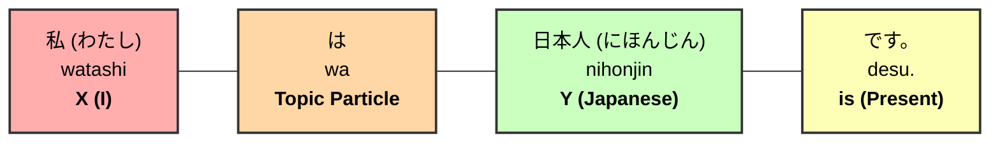

### B. Present Tense: "You are a student."
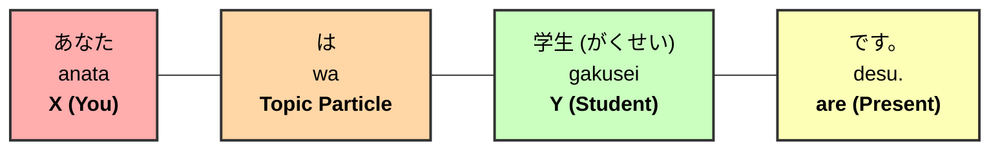

### C. Present Tense: "Today is Monday."
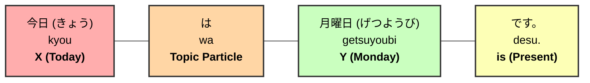

---

### D. Past Tense: "Yesterday was Sunday."
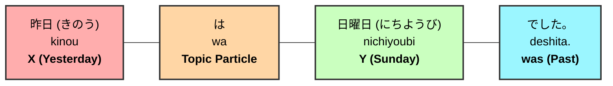

### E. Past Tense: "He was a teacher."
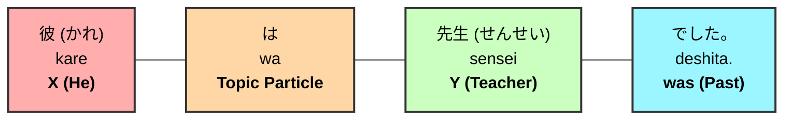

### F. Past Tense: "Dinner was sushi."
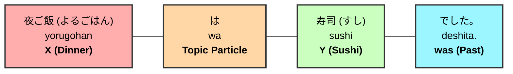

---

## 4. Practice Session (Statements)

Try to translate these sentences yourself!

1. **Today is Tuesday.**
2. **My name is Ken.**
3. **My birthday was yesterday.**
4. **My mother was a doctor.**

**[Check Statement Solutions Here](./grammar-solutions.md#1-present-sentence-practice)**

---

## 5. Asking Questions

In Japanese, we turn a statement into a question by simply adding **か (ka)** at the end.

### How to Build a Question (3 Steps)

| Step | Instruction | Example |
| :--- | :--- | :--- |
| **Step 1** | Build an affirmative sentence in English. | "Are you Japanese?" |
| **Step 2** | Translate the affirmative sentence to Japanese. | あなたは日本人です。 (Anata wa nihonjin desu.) |
| **Step 3** | Add **か?** at the end of the sentence. | **あなたは日本人ですか?** (Anata wa nihonjin desu **ka**?) |

---

### How to Answer a Question

#### Formal Responses (Standard)
1. **はい (Hai)** = Yes
2. **いいえ (Iie)** = No

#### Casual Responses (With Friends/Family)
1. **うん (Un)** = Yes
2. **ううん (Uun)** = No

---

## 6. Question Examples

### A. "Are you a student?"
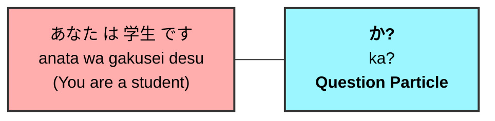

### B. "Was yesterday Sunday?"
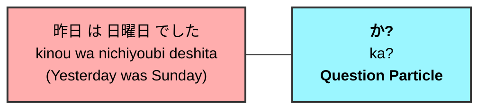

### C. "Was dinner sushi?"
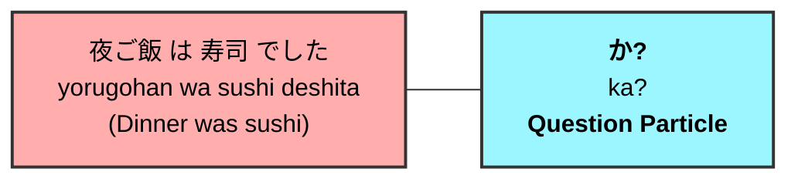

---

## 7. Practice Session (Questions)

Try to translate these questions:

1. **Is today Tuesday?**
2. **Is your name Miho?**
3. **Was your birthday yesterday?**
4. **Was your mother a doctor?**

**[Check Question Solutions Here](./grammar-solutions.md#3-asking-questions-practice)**

---

## 8. Questions with "What, Who, Where, and When"

When a question sentence includes any of the question words below, you will need to be careful with word order when building the sentence.

### The Question Words
- **What**: 何 (なに - nani / なん - nan)
- **Who**: 誰 (だれ - dare)
- **Where**: どこ (doko)
- **When**: いつ (itsu)

### How to Build a Question Word Sentence (2 Steps)

| Step | Instruction | Example Sentence |
| :--- | :--- | :--- |
| **Step 1** | Switch the words before and after "is/are" in English. | "Where is your house?" -> **"Your house is where?"** |
| **Step 2** | Translate the switched sentence into Japanese. | **あなたの家はどこですか。** (Anata no ie wa doko desu ka?) |

---

## 9. Examples with Diagrams

### A. "Where is your house?"
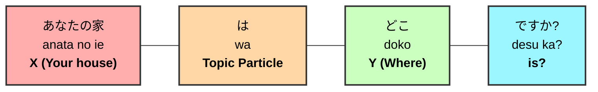

### B. "Who is your teacher?"
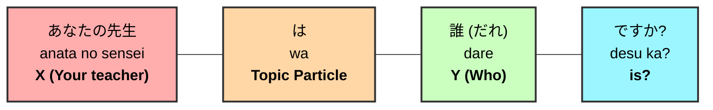

### C. "When is your birthday?"
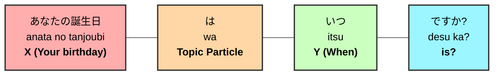

---

## 10. Practice Session (Question Words)

Try to translate these questions:

1. **What is your favorite food?**
2. **Where is your school?**
3. **When is the party?**
4. **Who is your favorite singer?**

**[Check Question Word Solutions Here](./grammar-solutions.md#4-question-word-practice-what-who-where-when)**

